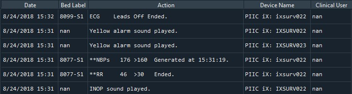

# ICU Analyzer
This repository contains the source code to efficiently analyze datasets that contain alarm-related data and nurse-monitor navigation actions sampled from multiple Phillips monitors (i.e., MX800). In this scenario, monitors are deployed in different ICU areas within a hospital. 

## Functionality
The goal of the framework is (1) to classify the different types of alarms generated by the monitors, i.e., alarm priority levels, nurse actions, (2) to determine the frequency of alarms generated according to its classification type, and (3) to provide different insights in order to reduce potential false alarms. 

## Directories
- `data`: Sample data that contains approximately 2 hours (or 1000 samples) of generated actions. The dataset includes the following 5 features.
    - **Date**: Time and date values when the alarm was generated by the monitor.
    - **Bed Label**: Bed ID where the monitor is currently deployed.
    - **Action**: Alarm name or navigation action displayed in the monitor. This can be either physiological (i.e., heart rate, oxygen levels), technical (i.e., probe disconnect, battery malfunction) or nurse navigation (i.e., increase/decrease alarm thresholds).
    - **Device Name**: Monitor ID used to record the generated alarm.
    - **Clinical User**: Registered entity used to extract datasets from central monitor. 

- `lib`: Contains the _medframe_ classes and _utility_ functions to analyze the alarm dataset.

## Usage
The `main.py` file includes several methods to be used to extract information and generate different _pandas DataFrames_ such as **ClinicFrame**, **TimeFrame**, **ThresholdFrame** and more. After data extraction, users may analyze the dataframes to generate insigths and produce plots accordingly. 